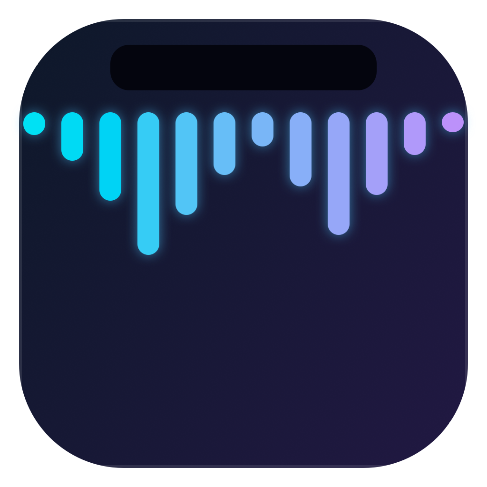

<p align="center">
  
</p>

<h1 align="center">WhisperWhy</h1>

<p align="center">
  <strong>Local-first dictation for macOS, notch style.</strong><br/>
  Press your hotkey combo, speak, press again — cleaned-up text lands at your cursor.<br/>
  No audio, transcript, or text ever leaves the machine.
</p>

<p align="center">
  
  
  
  
  
</p>

A free, fully-local take on [Wispr Flow](https://wisprflow.ai) /
[FreeFlow](https://github.com/zachlatta/freeflow) with an always-on-screen
**notch pill**: a compact animated logo + "WhisperWhy" wordmark. Anchor it
wherever you like — **top right** (default), top center, top left, left/right
screen edge, or a **floating dock** above the bottom edge — in
Settings → Notch.

Press your **configurable hotkey combo** (default ⌘⇧Space, record any
modifier+key in Settings) anywhere in macOS — or **click the notch logo** —
speak, press again to stop. Your words are transcribed **on-device by
whisper.cpp (Metal)**, cleaned up by a **local LLM** (Ollama by default —
fillers removed, grammar fixed, intent formatted), and pasted into whatever
text field the cursor is in. The notch never shows the transcript — it just
animates a checkmark when the paste lands.

---

## Install (one line)

```bash
curl -fsSL https://raw.githubusercontent.com/ankurCES/whisperWhy/main/install.sh | bash
```

This checks prerequisites (installs `cmake` via Homebrew if missing), clones
the repo to `~/.whisperwhy`, builds vendored whisper.cpp with Metal, downloads
a whisper model (~148 MB), builds and signs `WhisperWhy.app`, installs it to
`/Applications`, and pulls `llama3.2:3b` if Ollama is running.

Overrides: `WW_DIR=…` (checkout dir) · `WW_MODEL=small.en` (whisper model) ·
`WW_NO_OLLAMA=1` · `WW_NO_BREW=1`.

Then launch it:

```bash
open /Applications/WhisperWhy.app
```

### Manual build

Requirements: macOS 14+, Xcode or CLT, CMake (`brew install cmake`).

```bash
git clone https://github.com/ankurCES/whisperWhy.git
cd whisperWhy
make whisper      # clone + build vendored whisper.cpp (Metal on)
make model        # download ggml-base.en (~148 MB) into models/
make              # swiftc → build/WhisperWhy.app (ad-hoc signed)
make install      # copy to /Applications
make run          # launch from build/
```

Other targets: `make smoke` (transcribe a bundled sample through the real
model, no GUI), `make test` (unit tests), `make typecheck`,
`make model MODEL=small.en`, `make uninstall`.

## Permissions

macOS will ask on first use — all are required for the full pipeline:

| Permission | Why |
|---|---|
| **Microphone** | Dictation capture |
| **Accessibility** | Paste the final text at the focused cursor |
| **Input Monitoring** | Global hotkey-combo tap (click-to-dictate works without it) |
| **Speech Recognition** | Only if you switch to the Apple Speech engine |

## Use it

1. Put the cursor in any text field.
2. **Press your hotkey combo** (or **click the notch logo**) and speak — the
   pill opens with a live equalizer and timer. Press the combo (or click the
   logo again) to stop; **Esc** cancels.
3. The pill animates *transcribing → cleaning up*, draws a checkmark, and the
   cleaned text is pasted. The transcript is never displayed.

The tray icon opens **Settings**: STT engine (whisper.cpp or Apple Speech),
whisper model path/language, LLM endpoint + model, cleanup toggle, custom
system prompt, **hotkey combo recorder**, and a **Request Microphone
Permission** button with live status.

## Configure

Ollama is the default cleanup provider (`http://localhost:11434`,
`llama3.2:3b` — any model works):

```bash
brew install ollama && ollama serve &
ollama pull llama3.2:3b
```

Point the base URL at any OpenAI-compatible server (`/v1` is appended
automatically) — Ollama, LM Studio, llama.cpp server, Groq, OpenAI. Disable
cleanup entirely in Settings to paste raw whisper output.

## Features

| | |
|---|---|
| **Local STT** | whisper.cpp (ggml models, Metal accelerated) or Apple on-device Speech |
| **LLM cleanup** | Filler removal, grammar, punctuation via any OpenAI-compatible endpoint |
| **Paste anywhere** | Synthetic ⌘V at the focused cursor; clipboard snapshotted + restored; transient pasteboard markers keep clipboard managers from recording dictation |
| **Hotkey** | Configurable modifier+key combo (record in Settings); press to start, press again to stop; Esc cancels |
| **Notch UI** | Animated logo + "WhisperWhy" wordmark; click the logo to dictate. Recording → live equalizer + timer; processing → traveling wave + rotating status words; done → animated checkmark; transcript never shown |
| **Tray icon** | Status-item menu: Settings, model download, quit |
| **Keyboard-layout aware** | ⌘V resolves the V key via the current input source (non-ANSI layouts work) |

## Architecture

```
Sources/
  App.swift                  @main SwiftUI shim
  AppDelegate.swift          tray menu, wiring, lifetime
  HotkeyManager.swift        CGEvent tap: press-to-toggle combo, Esc cancel
  AudioRecorder.swift        AVAudioEngine → 16 kHz mono PCM WAV
  WhisperSTT.swift           whisper.cpp C interop (module map, Metal)
  AppleSpeechService.swift   on-device SFSpeechRecognizer fallback
  LLMCleanupService.swift    OpenAI-compatible /chat/completions cleanup
  TranscriptCore.swift       pure: finalize text, WAV decode (unit-tested)
  PasteService.swift         clipboard snapshot → ⌘V → restore
  DictationController.swift  pipeline orchestration
  NotchPanel.swift           borderless non-activating NSPanel
  NotchWindowController.swift top-edge placement (left/center/right), state sizing
  NotchViewModel/RootView    pill states + SwiftUI chrome
  SettingsStore/View         UserDefaults-backed settings + SwiftUI form
```

Pipeline: `hotkey → record → WAV → whisper → LLM cleanup → pasteboard → ⌘V`.
`make smoke` proves the STT half without a GUI; `make test` covers the pure
cores; an Ollama round-trip proves the cleanup half.

## Roadmap

- [ ] Launch-at-login wiring (setting is stored; `SMAppService` hookup pending)
- [ ] Multi-display placement (currently follows `NSScreen.main`)
- [ ] Optional streaming/partial transcripts
- [ ] Signed + notarized release builds

## Attribution

Design ideas and mechanisms borrowed with gratitude from
[FreeFlow](https://github.com/zachlatta/freeflow) (event-tap hotkeys, paste
pipeline, transient pasteboard markers, keyboard-layout key resolution) and
[codenotch](https://github.com/vinzdg/codenotch) (non-activating notch panel,
top-center placement, status item). STT by
[whisper.cpp](https://github.com/ggml-org/whisper.cpp). Logo generated
programmatically (AppKit).

## License

MIT
